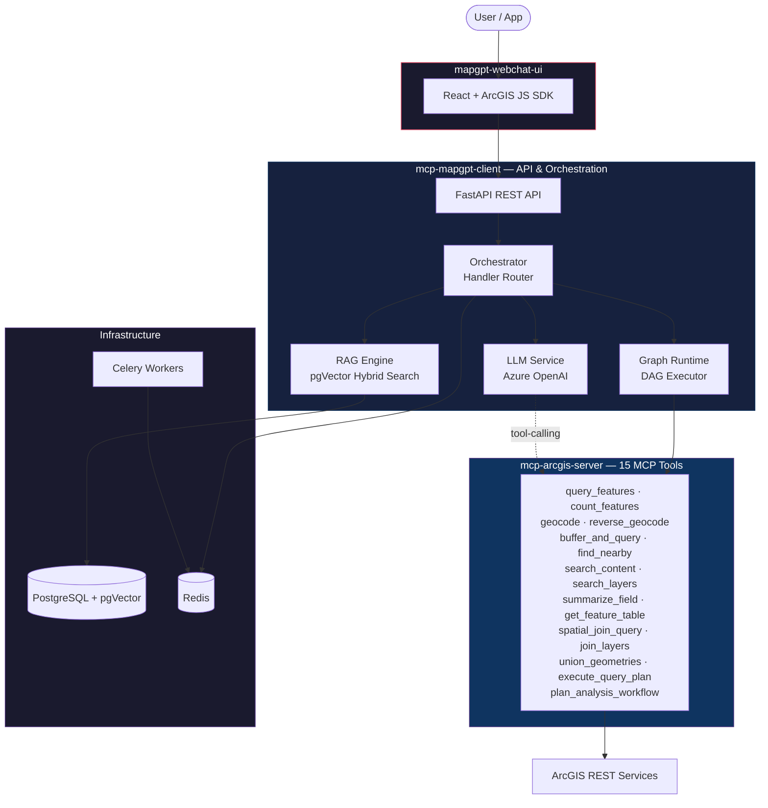
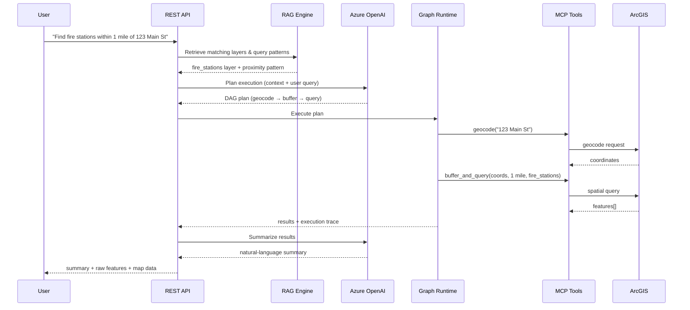

<div align="center">

# MapGPT — AI-Powered GIS Platform

**MCP Server &middot; RAG Pipeline &middot; LLM Orchestration &middot; ArcGIS**

Production-ready platform that turns natural-language questions into ArcGIS spatial queries, analysis workflows, and summarized results — powered by the Model Context Protocol, Retrieval-Augmented Generation, and Azure OpenAI.

[](LICENSE)
[]()
[]()
[]()
[]()

</div>

---

## Why This Project Exists

Most MCP servers expose a handful of tools and stop there. Real enterprise GIS workflows need more:

- **Context** — the LLM must know which layers, fields, and query patterns are available before it can plan.
- **Orchestration** — a single user question can require geocoding, buffering, spatial joins, and summarization executed as a DAG.
- **Observability** — every tool call, intermediate result, and LLM decision should be inspectable.

MapGPT combines an MCP tool server, a RAG knowledge base, and a graph-based orchestrator into a single deployable stack so teams can go from *"find hydrants within 500 ft of this address"* to a structured, auditable result in one request.

---

## Architecture



### Request Flow



---

## Key Capabilities

| Area | What It Does |
|------|-------------|
| **15 MCP Tools** | Query, geocode, buffer, proximity search, spatial joins, field statistics, content discovery, and multi-step plan execution |
| **RAG Knowledge Base** | pgVector-powered hybrid search (semantic + keyword) over ingested ArcGIS layer definitions, field metadata, and query patterns |
| **Graph Orchestrator** | DAG-based runtime with topological ordering, bounded parallelism, retry/backoff, and artifact tracking |
| **6 Orchestration Handlers** | `locate`, `summarize`, `summarize_stat`, `arcgis_execute`, `execute_llm`, `query` — each tailored to a class of GIS question |
| **Streaming API** | SSE endpoint with real-time progress events so the UI can show each step as it executes |
| **Web Chat UI** | React + TypeScript + ArcGIS JS SDK — slash commands, execution flow visualization, feature tables, and interactive map |
| **Background Tasks** | Celery workers for file ingestion and long-running analysis |

---

## Repository Structure

```text
.
├── mcp-arcgis-server/          # MCP tool server (15 ArcGIS tools)
│   └── mcp_arcgis_server/
│       ├── arcgis/             #   auth, client, geometry utils
│       ├── tools/              #   one module per tool
│       └── transport/          #   in-process & HTTP/SSE modes
│
├── mcp-mapgpt-client/          # API + orchestration layer
│   ├── api/                    #   FastAPI routes & schemas
│   ├── core/
│   │   ├── orchestrator/       #   handler router + graph runtime (DAG)
│   │   └── rag/                #   embeddings, retrieval, ingestion, prompts
│   ├── prompts/                #   system prompt templates
│   └── tasks/                  #   Celery background jobs
│
├── mapgpt-webchat-ui/          # Demo web client
│   ├── src/                    #   React + TypeScript + Zustand
│   └── e2e/                    #   Playwright end-to-end tests
│
├── alembic/                    # DB migrations (pgVector schema)
├── docker-compose.yml          # Full stack: Postgres, Redis, API, Celery, UI
└── .env.example                # Placeholder configuration
```

---

## Quick Start

### Prerequisites

- Docker & Docker Compose
- An ArcGIS portal or server with accessible feature layers
- An Azure OpenAI resource (chat + embedding deployments)

### 1. Configure

```bash
cp .env.example .env
# Edit .env with your credentials:
#   AZURE_OPENAI_API_KEY, AZURE_OPENAI_ENDPOINT, AZURE_OPENAI_DEPLOYMENT_NAME
#   ARCGIS_PORTAL_URL, ARCGIS_USERNAME, ARCGIS_PASSWORD
#   DATABASE_URL (auto-set by Compose)
```

### 2. Launch

```bash
# Core stack (API + MCP + Postgres + Redis + Celery)
docker compose up -d

# Include the demo web UI
docker compose --profile demo up -d
```

### 3. Use

| Endpoint | URL |
|----------|-----|
| API health | `http://localhost:8002/health` |
| Interactive docs | `http://localhost:8002/docs` |
| Demo UI | `http://localhost:8080` |

### 4. Ingest Your Layers

```bash
# Load ArcGIS layer definitions into the RAG knowledge base
curl -X POST http://localhost:8002/api/mapgpt/v1/ingest \
  -H "Content-Type: application/json" \
  -d '{"type": "layers", "source_url": "https://your-server/arcgis/rest/services"}'
```

---

## Example Queries

Once layers are ingested, try natural-language questions through the API or demo UI:

| Query | What Happens |
|-------|-------------|
| *"Find fire stations within 1 mile of 123 Main St"* | Geocode → buffer → spatial query → summarize |
| *"How many parcels are in the downtown district?"* | Layer lookup → spatial join → count |
| *"Show average property value by zone"* | Field classification → `summarize_field` → LLM summary |
| *"What layers are available for water infrastructure?"* | `search_layers` content discovery |

---

## API Reference

All endpoints are prefixed with `/api/mapgpt/v1`.

| Method | Endpoint | Purpose |
|--------|----------|---------|
| `GET` | `/commands` | List available slash commands |
| `POST` | `/query` | Generate a query plan (RAG + LLM, no execution) |
| `POST` | `/execute` | Full pipeline: plan → execute → return raw results |
| `POST` | `/execute/stream` | Streaming execution with SSE progress events |
| `POST` | `/arcgis-execute` | Direct LLM tool-calling (bypass RAG) |
| `POST` | `/execute-llm` | RAG-augmented LLM tool-calling |
| `POST` | `/summarize` | Execute + LLM summary of results |
| `POST` | `/locate` | Geocode or reverse-geocode a location |
| `POST` | `/summarize-stat` | Field statistics + LLM summary |
| `POST` | `/ingest` | Ingest layers or query patterns into the knowledge base |
| `POST` | `/user-feedback` | Submit feedback on responses |

Full OpenAPI schema is available at `/docs` when the service is running.

---

## Technology Stack

| Layer | Technology |
|-------|-----------|
| MCP Server | Python, Model Context Protocol SDK |
| API | FastAPI, Uvicorn |
| LLM | Azure OpenAI (GPT-4o + text-embedding-3-small) |
| RAG | pgVector (HNSW), hybrid semantic + keyword scoring |
| Database | PostgreSQL 16 + pgVector, Alembic migrations |
| Cache | Redis 7 |
| Background Jobs | Celery |
| GIS | ArcGIS Python API, ArcGIS REST Services |
| Web UI | React, TypeScript, Vite, Tailwind CSS, Zustand |
| Mapping | ArcGIS JavaScript SDK |
| Testing | pytest, Vitest, Playwright |
| Deployment | Docker Compose (multi-service) |

---

## MCP Tools Reference

The MCP server exposes 15 tools for spatial operations:

| Tool | Category | Description |
|------|----------|-------------|
| `query_features` | Query | Query features with WHERE clause, spatial filters, field selection |
| `count_features` | Query | Count features matching a filter |
| `geocode` | Location | Address to coordinates with ranked candidates |
| `reversegeocode` | Location | Coordinates to street address |
| `buffer_and_query` | Spatial | Buffer a geometry and query features within |
| `find_nearby` | Spatial | Find features near a point sorted by distance |
| `search_content` | Discovery | Search portal for content items by keyword |
| `search_layers` | Discovery | Discover available feature layers |
| `summarize_field` | Analysis | Compute field statistics (min, max, avg, stddev) or unique values |
| `get_feature_table` | Analysis | Retrieve a feature table for inspection |
| `spatial_join_query` | Spatial | Query boundary → union → filter target layer |
| `join_layers` | Spatial | Join two layers on a common attribute field |
| `union_geometries` | Geometry | Union multiple geometries into one |
| `execute_query_plan` | Workflow | Execute a full RAG+LLM query plan with parent-child joins |
| `plan_analysis_workflow` | Workflow | Generate an analysis workflow plan |

---

## Configuration Reference

Key environment variables (see `.env.example` for the complete list):

| Variable | Required | Description |
|----------|----------|-------------|
| `AZURE_OPENAI_API_KEY` | Yes | Azure OpenAI API key |
| `AZURE_OPENAI_ENDPOINT` | Yes | Azure OpenAI resource endpoint |
| `AZURE_OPENAI_DEPLOYMENT_NAME` | Yes | Chat completion deployment |
| `AZURE_OPENAI_EMBEDDING_DEPLOYMENT` | Yes | Embedding deployment (text-embedding-3-small) |
| `ARCGIS_PORTAL_URL` | Yes | ArcGIS portal or server URL |
| `ARCGIS_USERNAME` | Depends | Portal username (if authenticated) |
| `ARCGIS_PASSWORD` | Depends | Portal password (if authenticated) |
| `DATABASE_URL` | Yes | PostgreSQL connection string |
| `REDIS_URL` | Yes | Redis connection string |
| `VECTOR_SEARCH_TOP_K` | No | RAG retrieval limit (default: 5) |
| `VECTOR_SEARCH_MIN_SCORE` | No | Similarity threshold (default: 0.7) |
| `GRAPH_RUNTIME_ENABLED` | No | Enable DAG execution (default: true) |

---

## Contributing

Contributions are welcome. Areas where help is especially useful:

- Additional MCP tools (routing, geoprocessing, 3D analysis)
- Alternative LLM provider adapters (Anthropic, local models)
- RAG ingestion for new data source types
- Performance benchmarks and optimization
- Documentation and examples

If publishing a derived version, review your environment files and prompt templates before release.

---

## License

[Apache License 2.0](LICENSE)
